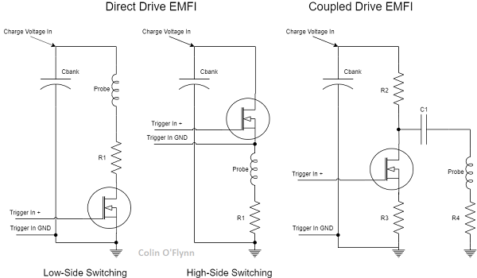
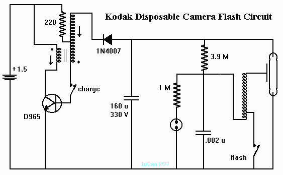
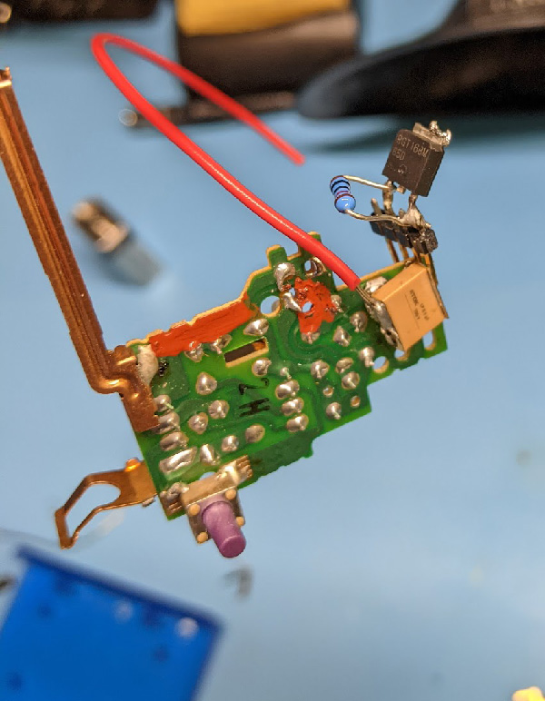
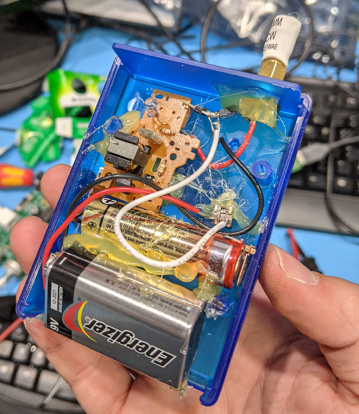

**WARNING: THIS PAGE SHOWS USAGE OF HIGH VOLTAGE CIRCUITRY - YOU CAN EASILY GET A DANGEROUS OR LETHAL SHOCK FROM ATTEMPTING TO FOLLOW THESE INSTRUCTIONS. I BUILT THE [CHIPSHOUTER](https://www.newae.com/chipshouter) TOOL SPECIFICALLY TO AVOID EXPOSING YOU TO THE TYPES OF RISKS THAT ARE SHOWN IN THE CONSTRUCTION ON THIS PAGE. CONSIDER THE FOLLOWING FOR ENTERTAINMENT PURPOSES ONLY.**

Colin O'Flynn
Nov 20 / 2021

The following are some details to go along with my Hackaday Remoticon 2021 presentation.

## EMFI Architectures

Generally, EMFI is one of three types of architectures:

(This figure is from my book [Hardware Hacking Handbook](https://nostarch.com/hardwarehacking) if you'd like more details it's got a section on EMFI as well).

Of those three, "direct drive" is somewhat easiest to swap probe tips for. But the downside is that it can expose the high voltage most directly to the probe tip (and thus user or DUT). Of the two "direct drive" architectures the low-side switching is easiest to build, but by far the most dangerous. This is because the capacitor bank is *always* present at the output, rather than being switched on only when needed.

My commercial tool, the [ChipSHOUTER}(https://www.newae.com/chipshouter) contains several safety features, including:

* 'High-side switching' drive ensures high voltage present only during pulses.
* Passive HV bleed resistor on capacitor bank, discharges in ~30 seconds.
* Active HV bleed resistor when unit is disarmed or safety interlocks trigger, discharges in < 5 seconds.
* Three different conformal/potting compounds used around high-voltage circuitry.
* High-temp PCB.
* Detection of probe tip break or open (which means pulse will discharge into something besides the inductor coil).
* Over-temp detection (interlock).
* Case open detection (interlock).
* Detection of out-of-spec voltage on input (power supply) or output (HV charge generation).

The following example will have *none* of those. Zero. It will also use the more dangerous low-side switching.

## About a Disposable Camera Flash

When these cameras were much more common, you use to be able to get tens of the disposable cameras for free just by asking (they would ship the bodies back after film was removed). Worst case you can still buy them for fairly cheap - the example I'm using was a 2-pack of cameras from Walmart for $20. 

You can find reverse engineering of the camera flash details in a few places. The closest one to my camera was by Brian Mork, available at [http://www.increa.com/reverse/dc/](http://www.increa.com/reverse/dc/).

For quick reference, I've mirrored the schematic Brian reverse engineered here, but see his page for more details of the operation:

**WARNING: The circuitry contains various "buttons" such as charge and flash. These buttons will be at HIGH VOLTAGE RELATIVE TO OTHER PARTS OF THE CIRCUIT. Do NOT touch the metal "buttons" yourself, but use an insulated screwdriver to trigger them.**

This last point is the most important - don't just hold a battery in the charger, as it's *very easy* to shock yourself when doing this.

If you haven't worked with these units before, the typical way to "safely" handle them is:

* Trigger the flash to discharge the capacitor a little bit.
* Short the main capacitor - commonly done with a screwdriver, if you were fancy you'd use a resistor.
* Use alligator clips to short out the main capacitor now that it's discharged, to prevent charge from building back up or you from accidentally turning it on.

Watch out for the problem that it's easy to shock yourself when attempting to remove the battery too, so short the capacitor out before you touch *anything*.

## Safely Operating a Low-Side Switch

As mentioned, using a low-side switch is inherently a very dangerous operation. The exposed "coil" will be charged to 400V anytime the device is on, *not* only during the discharge operation.

The only safe way to use a low-side switching EMFI tool is to isolate everything else, such the exposed coil has no ground reference (and thus no path to discharge). This means you must use either battery powered or an isolated power supply. In this example we'll stick with battery powered which is much easier to build.

**WARNING: Do not use a random wall-wart power supply and assume that counts as isolated. The DC negative may be connected to earth ground, I've also had wall-warts where the DC negative was connected through to the neutral blade.**

This means we'll do the following:

* Power the charger from 1.5V battery (as designed)
* Power anything else (trigger circuitry) from a different 9V battery.
* Use plastic/isolated buttons as needed.
* Optoisolate any signals passing to the tool.

**WARNING: I really must stress that you shouldn't try to derive one of the supplies from each other, or try to use a plug-in supply or bench supply. This unit is very unsafe even as-is, and the only small margin of safety comes from the battery power giving the floating supplies.**

## Camera Flash Modifications for EMFI

The camera flash is basically going to be our high-voltage source. We'll do the following modifications:

* Replace main capacitor with smaller ceramic capacitor.
* Add high-voltage IGBT/MOSFET.
* Add resistor to 'turn off' mosfet by default.
* Add output connector or coil.
* Add insulated arm button.
* Add insulated trigger button.
* OPTIONAL: Add opto-isolator for trigger input.

The opto-isolator isn't shown, but almost any one should work. The only important specification would be that the "collector to emitter voltage" is at *least* 20V, but that covers almost all common units. If you want to use an optoisolator (so you can trigger the unit on demand), simply do the following:

* Optoisolator collector to 9V battery positive.
* Optoisolator emmiter to IGBT gate.
* Change the 10k-ohm gate drain resistor to something smaller (1k-ohm), but may need to test this.

Note even with the switch using a smaller resistor may be helpful (again, faster turn-off, the 10k was one I happened to have on-hand).

## Parts Selection

#### Capacitor
The main cap should be around 0.33 to 1uF, 630V or higher rated (the higher-than-needed voltage helps with loss of capacitance due to voltage biasing along with a safety margin). I used B58031U7504M062 in my example (0.5uF, 700V rated) as I had it on-hand.

If redoing this, I'd try using C350C474KBR5TA which is a through-hole part, so may actually fit correctly onto the PCB.

#### MOSFET/IGBT

The switch element will need to be rated with sufficient voltage & current. I had on-hand a RGT16BM65DTL which is rated for 650V, and 16A continuous (24A pulsed). We'll only be using these in pulse modes.

The on/off test time was 13ns/33ns - you want something relatively fast. When I was looking before I found mostly SMD seemed to meet the requirements, so I'd use SMD for this. Both MOSFETs and IGBT should be fine.

I would *avoid* logic-level switching devices (fully turned on at 3.3V/5V). They will be more sensitive to gate punch-through due to the lower rating on the maximum Vges. We are going to have lots of "bad noise" around our circuit, and since the source for our switching supply is a 9V battery we can mostly turn on a regular MOSFET/IGBT.

The Vges of this device is +/- 30V.

#### Coil / Injector

You'll need something to inject the pulse - I'm using ChipSHOUTER tips I had on-hand. But you can create something by finding a 2mm to 6mm ferrite rod, and wrapping 6 to 10 around it of ~22AWG magnet wire (adafruit sells an assortment that includes 22AWG). Search digikey for 'ferrite rod' in the *Ferrite Cores* category for the cores.

You can also just buy ferrite-core inductors - there was a line from Wurth Electronics that seems to be discontinoued now, so I don't have useful part numbers to give you.

Add some polymide tape (the 'Kapton' brandname) which is very thin but has good high voltage properties. While the fully isolated nature of your probe should avoid any higher-current paths from the probe tip which would certainly fry your device under test, there may be coupling with direct contact.

## Modification Example

The following shows the SMD cap soldered on. Notice I replaced the charge button with one with a very large plastic plunger which I can mount through a case:

Lots of hot glue are used to hold everything in place. Once the case is (almost) closed I only need to touch the plastic charge & pulse buttons.

In this example I mounted a SMA connector, as my coils were built with SMA connectors on them. There is no need to do this if you're only using one coil.

You can also use different output methods such as screw terminals if you want to swap coils, but don't want the hassle of building things into SMA connectors.

**WARNING: EVERYTHING ON THIS PAGE IS NOT PRESENTED AS A SAFE OR GOOD EXAMPLE OF WAYS TO DO THINGS. THIS IS PRESENTED FOR ENTERTAINMENT PURPOSES ONLY.**